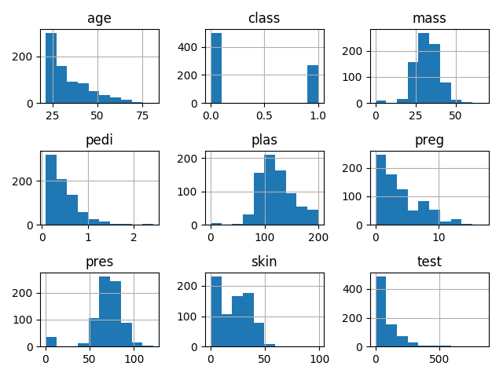
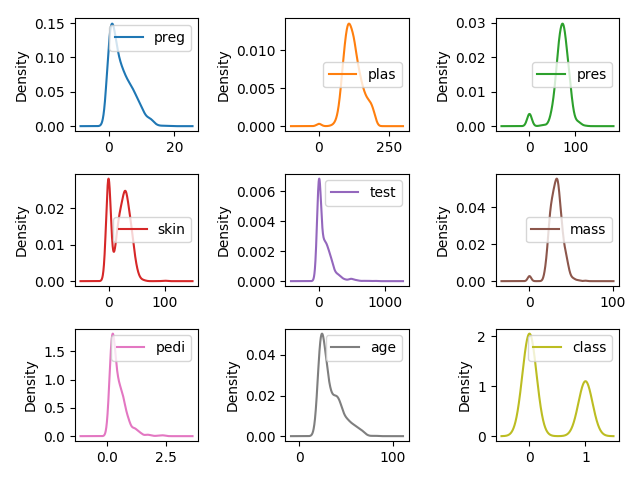
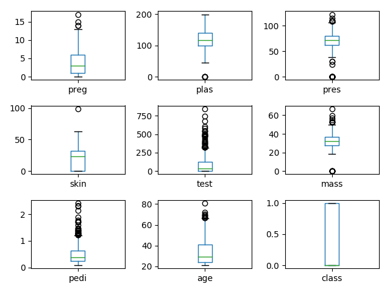
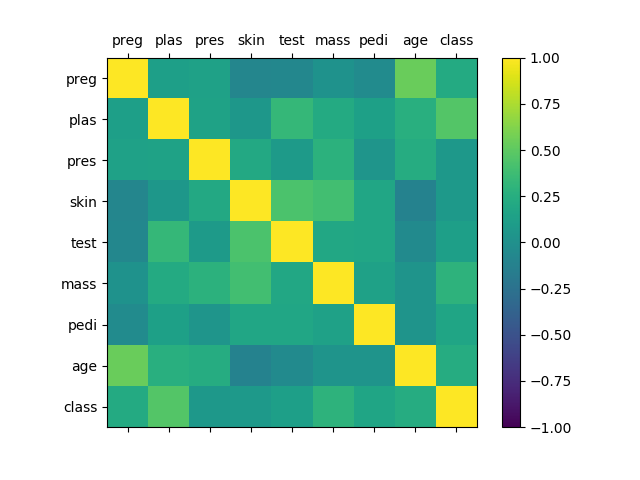
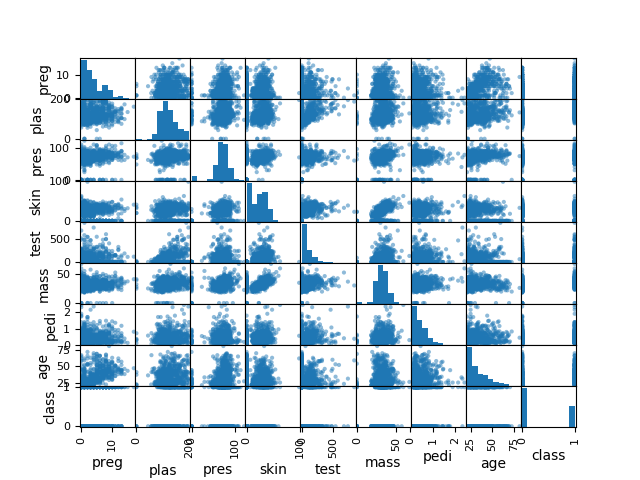

# 数据可视化

最快的方法就是通过数据的可视化来加强对数据的理解。使用的数据集还是Pima Indians

## 1.单一图表

本章3种图表

- 直方图
- 密度图
- 箱线图

### 1.1.直方图

直方图（Histogram）又称质量分布图，是一种统计报告图。通过图表可以看出数据是高斯分布、指数分布还是偏态分布。代码如下：

```python
from pandas import read_csv
import matplotlib.pyplot as plt

filename = 'pima_data.csv'
names = ['preg', 'plas', 'pres', 'skin', 'test', 'mass', 'pedi', 'age', 'class']
data = read_csv(filename, names=names)
data.hist()
plt.tight_layout()
plt.show()
```



我们可以看到age、pedi 和 test也许是指数分布；mass、pres 和 plas也许是高斯分布。

### 1.2.密度图

密度图是一种表现与数据值对应的边界与域对象的图形表示方法，一般用于呈现连续变量。密度图类似于对直方图进行抽象，用平滑的线来描述数据的分布。这也是一种用来显示数据分布的图表。代码如下：

```python
filename = 'pima_data.csv'
names = ['preg', 'plas', 'pres', 'skin', 'test', 'mass', 'pedi', 'age', 'class']
data = read_csv(filename, names=names)
data.plot(kind='density', subplots=True, layout=[3, 3], sharex=False)
plt.tight_layout()
plt.show()
```



### 1.3.箱线图

箱线图又称盒须图、盒式图或箱型图，是一种用于显示一组数据分散情况的统计图。因形状如箱子而得名。此图是一种很好的用于显示数据分布情况的手段。首先画一条中位数线，然后以下四分位数和上四分位数画一个盒子，上下各有一条横线，表示上下边缘，通过很闲来显示数据的伸展状况，游离在边缘之外的点为异常值。代码如下：

```python
filename = 'pima_data.csv'
names = ['preg', 'plas', 'pres', 'skin', 'test', 'mass', 'pedi', 'age', 'class']
data = read_csv(filename, names=names)
data.plot(kind='box', subplots=True, layout=(3, 3), sharex=False)
plt.tight_layout()
plt.show()
```



## 2.多重图表

接下来介绍两种图表，以显示不同属性之间的关联关系：相关矩阵图和散点矩阵图。

### 2.1.相关矩阵图

相关矩阵图用来展示两个不同属性相互影响的程度。如果两个属性按照相同的方向变化，说明是正向影响。如果朝相反方向变化，说明是反向影响。把所有属性两两影响的关系展示出来的图表就叫相关矩阵图。矩阵图法就是从多维问题的事件中找出成对的因素，排列成矩阵图，然后根据矩阵图来分析问题，确定关键点。它是一个通过多因素综合思考来探索问题的好方法。代码如下：

```python
filename = 'pima_data.csv'
names = ['preg', 'plas', 'pres', 'skin', 'test', 'mass', 'pedi', 'age', 'class']
data = read_csv(filename, names=names)
correlations = data.corr()
fig = plt.figure()
ax = fig.add_subplot(111)
cax = ax.matshow(correlations, vmin=-1, vmax=1)
fig.colorbar(cax)
ticks = np.arange(0, 9, 1)
ax.set_xticks(ticks)
ax.set_yticks(ticks)
ax.set_xticklabels(names)
ax.set_yticklabels(names)
plt.show()
```



### 2.2.散点矩阵图

散点矩阵图表示因变量随自变量变化的大致趋势，据此可以选择合适的函数对数据点进行拟合。散点矩阵图由两组数据构成过多个坐标点，考察坐标点的分布，可以判断两个变量之间是否存在某种关联或总结坐标点的分布模式。散点矩阵图将序列显示为一组点，值由点在图表中的位置表示，类别由图表中的不同标记表示。散点矩阵图通常用于比较跨类别的聚合数据。当同时考察多个变量的相关关系时，若一一绘制它们的简单散点图将十分麻烦。此时可利用散点矩阵图来绘制各个变量之间的散点图，这样可以快速发现多个变量间的主要相关性，这在进行多元线性回归时显得尤为重要。代码如下：

```python
filename = 'pima_data.csv'
names = ['preg', 'plas', 'pres', 'skin', 'test', 'mass', 'pedi', 'age', 'class']
data = read_csv(filename, names=names)
scatter_matrix(data)
plt.show()
```

