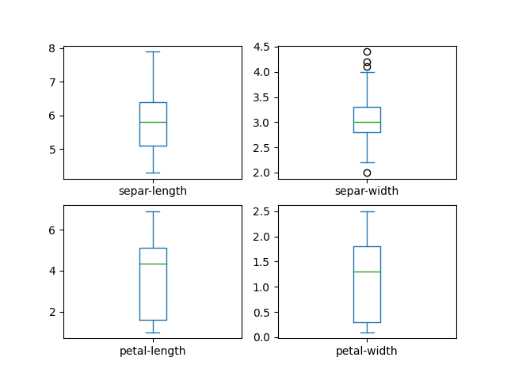
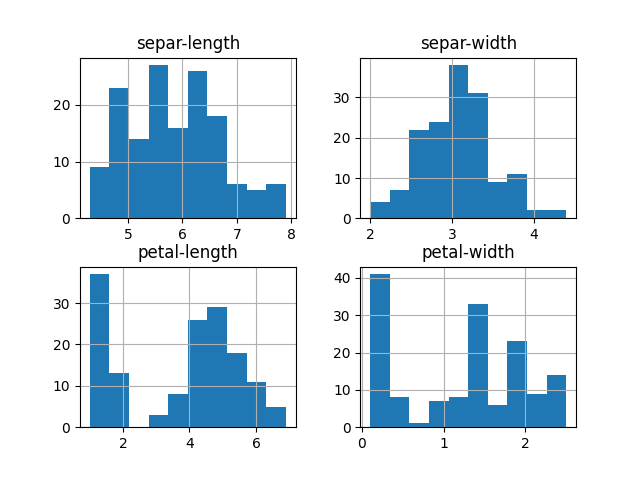
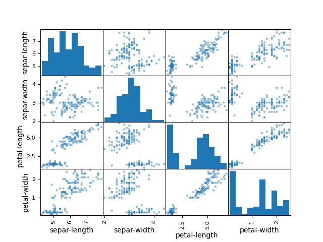
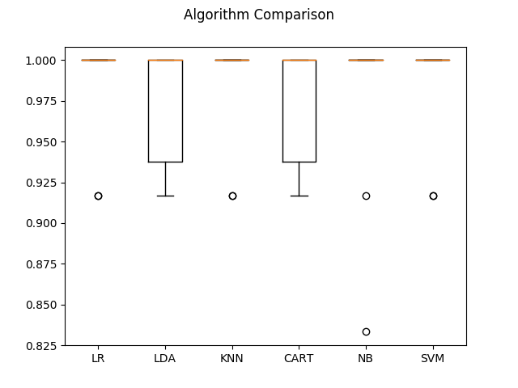

# 鸢尾花

## 1.机器学习中的Hello World项目

这个项目是针对鸢尾花进行分类的一个项目，数据集是含鸢尾花的三个亚属的分类信息，通过机器学习算法生成一个模型，自动分类新数据到这三个亚属的某一个中。项目中使用的鸢尾花数据集是一个非常容易理解的数据集，这个数据集具有以下特点：

- 所有特征数据都是数字，不需要考虑如何导入和处理数据。
- 这是一个分类问题，可以很方便地通过有监督学习算法来解决问题。
- 这是一个多分类问题，也许需要一些特殊处理。
- 所有的特征的数值采用相同的单位，不需要进行尺度的转换。

接下来我们将通过这个例子来一步步地展示一个机器学习项目的所有步骤。我们将按照下面的步骤实现这个项目：

1. 导入数据
2. 概述数据
3. 数据可视化
4. 评估算法
5. 实施预测

## 2.导入数据

### 2.1.导入类库

```python
#   导入类库
from pandas import read_csv
from pandas.plotting import scatter_matrix
from matplotlib import pyplot
from sklearn.model_selection import train_test_split
from sklearn.model_selection import KFold
from sklearn.model_selection import cross_val_score
from sklearn.metrics import classification_report
from sklearn.metrics import confusion_matrix
from sklearn.metrics import accuracy_score
from sklearn.linear_model import LogisticRegression
from sklearn.tree import DecisionTreeClassifier
from sklearn.discriminant_analysis import LinearDiscriminantAnalysis
from sklearn.naive_bayes import GaussianNB
from sklearn.svm import SVC
```

### 2.2. 导入数据集

在UCI机器学习仓库下载[鸢尾花数据集](http://archive.ics.uci.edu/ml/datasets/Iris)，下载完成后保存在项目的统计目录中。在这里使用Pandas来导入数据和对数据进行描述性统计分析，并利用Matplotlib实现数据可视化。需要注意的是，在导入数据时，为每个数据特征设定了名称，这有助于后面对数据的展示工作，尤其是通过图表展示数据。代码如下：

```python
filename = 'iris.data.csv'
names = ['separ-length', 'separ-width', 'petal-length', 'petal-width', 'class']
dataset = read_csv(filename, names=names)
```

## 3.概述数据

需要先看一下数据，增加对数据的理解，以便选择合适的算法。我们将从以下几个角度来审查数据：

1. 数据的维度。
2. 查看数据自身。
3. 统计描述所有的数据特征。
4. 数据分类的分布情况。

### 3.1.数据维度

通过查看数据的维度，可以对数据集有一个大概的了解，如数据集中有多少行数据、数据有几个属性等。代码如下：

```python
#   显示数据维度
print('数据维度：行 %s, 列 %s' % dataset.shape)
```

将会得到一个具有150行数据，5个数据特征属性的结果，执行结果如下:

```
数据维度：行 150, 列 5
```

### 3.2. 查看数据自身

查看数据自身也是一个很好的理解数据的方法，通过查看数据可以直观地看到数据的特征，数据的类型，以及大概的数据分布范围等。代码如下：

```python
#   查看数据前10行
print(dataset.head(10))
```

```
separ-length  separ-width  petal-length  petal-width        class
0           5.1          3.5           1.4          0.2  Iris-setosa
1           4.9          3.0           1.4          0.2  Iris-setosa
2           4.7          3.2           1.3          0.2  Iris-setosa
3           4.6          3.1           1.5          0.2  Iris-setosa
4           5.0          3.6           1.4          0.2  Iris-setosa
5           5.4          3.9           1.7          0.4  Iris-setosa
6           4.6          3.4           1.4          0.3  Iris-setosa
7           5.0          3.4           1.5          0.2  Iris-setosa
8           4.4          2.9           1.4          0.2  Iris-setosa
9           4.9          3.1           1.5          0.1  Iris-setosa
```

### 3.3. 统计描述数据

数据特征的统计描述信息包括数据的行数、中位值、最大值、最小值、均值、四分位值等统计数据信息。代码如下：

```python
# 统计描述数据信息
print(dataset.describe())
```

执行结果如下：

```
       separ-length  separ-width  petal-length  petal-width
count    150.000000   150.000000    150.000000   150.000000
mean       5.843333     3.054000      3.758667     1.198667
std        0.828066     0.433594      1.764420     0.763161
min        4.300000     2.000000      1.000000     0.100000
25%        5.100000     2.800000      1.600000     0.300000
50%        5.800000     3.000000      4.350000     1.300000
75%        6.400000     3.300000      5.100000     1.800000
max        7.900000     4.400000      6.900000     2.500000
```

### 3.4.数据分类分布

接下来看数据在不同分类的分布情况，执行程序后得到的将是每个分类数据量的绝对的数值，看一下各个分类的数据分布是否均衡。代码如下：

```python
#   分类分布情况
print(dataset.groupby('class').size())
```

执行结果如下：

```
class
Iris-setosa        50
Iris-versicolor    50
Iris-virginica     50
dtype: int64
```

我们这里可以看到鸢尾花三个亚种的数据各50条，分布非常平衡，如果数据分布不平衡，可能会影响到模型的准确度。因此，当数据分布不平衡时，需要对数据进行处理，调整数据到平衡的状态。调整数据平衡时有以下几种方法。

- **扩大数据样本**：一个更大的数据集，就有可能挖掘出不同的或许更平衡的方面提高算法模型的准确度。
- **数据的重新抽样**：过抽样（复制少数类样本）和欠抽样（删除多数类样本）。当数据量很大时可以考虑测试欠抽样（大于一万条记录）。当数据量比较少时可以考虑过抽样。
- **尝试生成人工样本**：从少数类的实例中随机抽样特征属性，生成更多的数据。
- **异常检测和变化检测**：异常检测是对罕见事件的检测。这种思维的转变在于考虑以小类作为异常值类，它可以帮助获得一种新方法分离和分类样本。

## 4.数据可视化

### 4.1.单变量图表

- 单变量图表可以更好地理解每一个特征属性。
- 多向量图表用于理解不同特征属性之间的关系。

```python
dataset.plot(kind='box', subplots=True, layout=(2,2), sharex=False, sharey=False)
pyplot.show()
```

执行结果如下：



还可以通过直方图来显示每个特征属性的分布情况。代码如下：

```python
#   直方图
dataset.hist()
pyplot.show()
```

执行结果如下。`separ-length` 和 `separ-width`符合高斯分布。



### 4.2.多变量图表

散点矩阵图

```python
#   散点矩阵图
scatter_matrix(dataset)
pyplot.show()
```

执行结果如下:



## 5.评估算法

通过不同的算法来创建模型，并评估它们的准确度，以便找到最合适的算法。将按照下面的步骤进行操作：

1. 分离出评估数据集。
2. 采用10折交叉验证来评估算法模型。
3. 生成6个不同的模型来预测新数据。
4. 选择最优模型。

### 5.1.分离出评估数据集

模型被创建之后要知道创建的模型是否足够好。在选择算法的过程中会采用统计学方法来评估算法模型。但是我们更想知道算法模型对真实数据的准确度如何，这就是保留一部分数据来评估算法模型的主要原因。下面将按照80%的训练数据集，20%的评估数据集来分离数据。代码如下：

```python
# 分离数据集
array = dataset.values
X = array[:, 0:4 ]
Y = array[:, 4]
validation_size = 0.2
seed = 7
X_train, X_validation, Y_train, Y_validation = train_test_split(X, Y, test_size=validation_size, random_state=seed)
```

一般将样本集划分为3类

训练集：training set ——>训练模型fit (课本) 60%

验证集：validation set ——>调参、优化（作业）20%

测试集：test set ——>调试（考试） 20%

分离出X_train和Y_train用来训练算法创建模型，X_validation和Y_validation在后面会用来验证评估模型。

### 5.2. 评估模式

在这里通过10折交叉验证来分离训练数据集，并评估算法模型的准确度。10折交叉验证是随机将数据分成10份：9份用来训练模型，1份用来评估算法。后面我们会使用相同的数据对每一种算法进行悬链和评估，并从中选出最好的模型。

### 5.3.创建模型

对任何问题来说，不能仅通过对数据进行审查，就判断出哪个算法最有效。通过前面的图表，发现有些数据特征符合线性分布，所以可以期待算法会得到比较好的结果。接下来评价六种不同的算法：

- 线性回归（LR）
- 线性判别分析（LDA）
- K近邻（KNN）
- 分类与回归树（CART）
- 贝叶斯分类器（NB）
- 支持向量机（SVM）

这个算法列表前两个是线性算法，剩下的是非线性算法。在每次对算法进行评估前都会重新设置随机数的种子，以确保每次对算法的评估都使用相同的数据集，保证算法评估的准确性。接下来就创建并评估之六种算法模型，代码如下：

```python
#   算法审查
    models = {}
    models['LR'] = LogisticRegression(max_iter=1000)
    models['LDA'] = LinearDiscriminantAnalysis()
    models['KNN'] = KNeighborsClassifier()
    models['CART'] = DecisionTreeClassifier()
    models['NB'] = GaussianNB()
    models['SVM'] = SVC()
    #   评估算法
    results = []
    for key in models:
        kfold = KFold(n_splits=10, random_state=None)
        cv_results = cross_val_score(models[key], X_train, Y_train,cv=kfold, scoring='accuracy')
        results.append(cv_results)
        print('%s: %f (%f)' % (key, cv_results.mean(),cv_results.std()))
```

### 5.4.选择最优模型

现在已经有了六种模型，并且评估了它们的精确度。接下来就需要比较这六种模型，并选出准确度最高的算法。执行上面的代码，结果如下：

```
LR: 0.983333 (0.033333)
LDA: 0.975000 (0.038188)
KNN: 0.983333 (0.033333)
CART: 0.975000 (0.038188)
NB: 0.975000 (0.053359)
SVM: 0.983333 (0.033333)
```

通过上面的结果，很容易看出SVM算法具有最高的准确度得分。接下来创建一个箱线图，通过图表来比较算法的评估结果。代码如下：

```python
# 箱线图比较算法
    fig = pyplot.figure()
    fig.suptitle('Algorithm Comparison')
    ax = fig.add_subplot(111)
    pyplot.boxplot(results)
    ax.set_xticklabels(models.keys())
    pyplot.show()
```

执行结果如下



## 6.实施预测

评估的结果显示，支持向量机（SVM）是准确度最高的算法。现在使用预留的评估数据集来验证这个算法模型。这将会对生成的算法模型的准确度有一个更加直观的认识。、

现在使用全部训练集的数据生成支持向量机（SVM）的算法模型，并用预留的评估数据集给出一个算法模型的报告。代码如下：

```python
# 使用评估数据集评估算法
    svm = SVC()
    svm.fit(X=X_train, y=Y_train)
    predictions = svm.predict(X_validation)
    print(accuracy_score(Y_validation, predictions))
    print(confusion_matrix(Y_validation, predictions))
    print(classification_report(Y_validation, predictions))
```

执行程序后，看到算法模型的准确度是0.93。通过冲突矩阵看到只有*两个*数据预留错误。最后还提供了一个包含精确率（precision）、召回率（recall）、F1值（F1-score）等数据的报告。结果如下：

```
0.8666666666666667
[[ 7  0  0]
 [ 0 10  2]
 [ 0  2  9]]
                 precision    recall  f1-score   support

    Iris-setosa       1.00      1.00      1.00         7
Iris-versicolor       0.83      0.83      0.83        12
 Iris-virginica       0.82      0.82      0.82        11

       accuracy                           0.87        30
      macro avg       0.88      0.88      0.88        30
   weighted avg       0.87      0.87      0.87        30
```

## 7.总结

至此，完成第一个机器学习项目。
