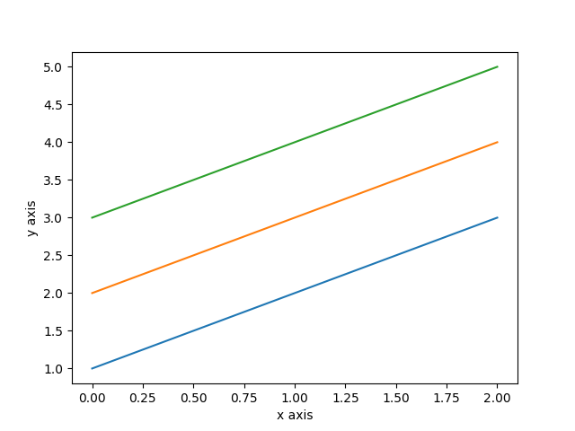
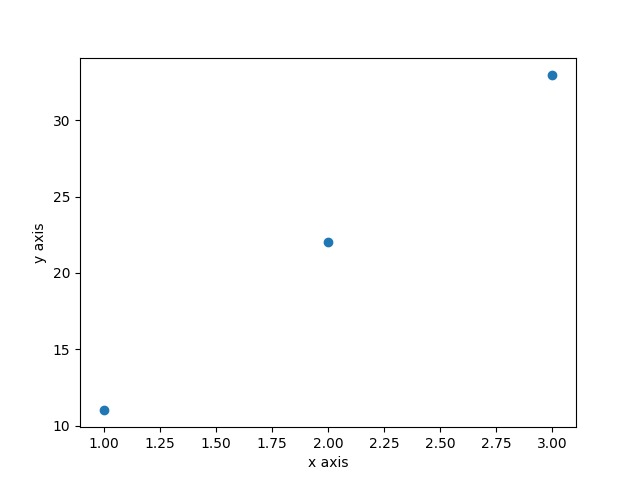

# SciPy速成

## 1.NumPy速成

NumPy为SciPy提供了基本的数据结构和运算，其中最主要的是ndarrays多维数组，它提供了高效的矢量运算功能。

### 1.1.创建数组

利用NumPy创建多维数组非常简单，通过给array函数传递Python的序列对象创建数组，如果传递的是多层嵌套的序列，将创建多维数组。代码如下：

```python
import numpy as np


def main():
    #   创建数组
    myarray = np.array([1, 2, 3])
    print(myarray)
    print(myarray.shape)
    #   创建了多维数组
    myarray = np.array([[1, 2, 3], [2, 3, 4], [3, 4, 5]])
    print(myarray)
    print(myarray.shape)

if __name__ == '__main__':
    main()
```

执行结果如下：

```
[1 2 3]
(3,)
[[1 2 3]
 [2 3 4]
 [3 4 5]]
(3, 3)
```

### 1.2.访问数据

对于ndarray数组的访问，我们可以通过数组的下标访问某一行，也可以访问某一列。代码如下：

```python
#   创建了多维数组
    myarray = np.array([[1, 2, 3], [2, 3, 4], [3, 4, 5]])
    print(myarray)
    print(myarray.shape)
    #   访问数据
    print('这是第一行：%s' % myarray[0])
    print('这是最后一行：%s' % myarray[-1])
    print('访问整列（3列）数据： %s' % myarray[:, 2])
    print('访问指定行（2行）和列（3列）的数据：%s' % myarray[1, 2])
```

执行结果如下：

```
[[1 2 3]
 [2 3 4]
 [3 4 5]]
(3, 3)
这是第一行：[1 2 3]
这是最后一行：[3 4 5]
访问整列（3列）数据： [3 4 5]
访问指定行（2行）和列（3列）的数据：4
```

### 1.3.算术运算

使用NumPy的ndarray数组可以直接进行算数运算，或者说向量运算。代码如下：

```python
import numpy as np

def main():
    #   创建了多维数组
    myarray1 = np.array([[1, 2, 3], [2, 3, 4], [3, 4, 5]])
    myarray2 = np.array([[11, 21, 31], [21, 31, 41], [31, 41, 51]])
    print('向量加法运算：')
    print(myarray1 + myarray2)
    print('向量乘法运算：')
    print(myarray1 * myarray2)
```

执行结果如下：

```
向量加法运算：
[[12 23 34]
 [23 34 45]
 [34 45 56]]
向量乘法运算：
[[ 11  42  93]
 [ 42  93 164]
 [ 93 164 255]]
```

NumPy主要用来处理大量数字的应用，通过这三个例子，熟悉了NumPy的多维数组的定义、访问和向量运算。

### 这里说一下numpy数组的切片操作。

X[n0, n1]是通过NumPy库引用二维数组或矩阵中的某一段数据集的一种写法。类似的，X[n0, n1, n2]表示取三维数组，取N维数组则有N个参数，N-1逗号分隔。以二维数组为例：

```python
X = np.array([[0, 1, 2, 3], [10, 11, 12, 13], [20, 21, 22, 23], [30, 31, 32, 33]])
```

X是一个二维数组，维度分别为0， 1；为了理解多维，采取数中括号的方式'['确定维数，例如：从左往右，第0层[]表示第0维；第一层[]表示第1维；...依此类推。

#### 取元素X[n0, n1]

这是最基本的情况，表示取 第0维 的第 n0 个元素，继续取 第1维 的第 n1个元素。如 X[2,2] 表示第0维第2个元素[20,21,22,23],然后取其第1维的第2个元素即 22；

#### 切片 X[s0:e0,s1:e1]

这是最通用的切片操作，表示取 第0维 的第 s0 到 e0 个元素，继续取 第1维 的第 s1 到 e1 个元素（左闭右开）。如 X[1:3,1:3] 表示第0维第(1:3)个元素[[10,11,12,13],[20,21,22,23]],然后取其第1维的第(1:3)个元素即 [[11,12],[21,22]]；

#### 切片特殊情况 X[:e0,s1:]

特殊情况，即左边从0开始可以省略X[:e0,s1:e1]，右边到结尾可以省略X[s0:,s1:e1]，取某一维全部元素X[:,s1:e1]，事实上和Python 的 序列切片规则是一样的。

常见的 X[:,0] 则表示 第0维取全部，第1维取0号元素；

```python
import numpy as np

X = np.array([[0,1,2,3],[10,11,12,13],[20,21,22,23],[30,31,32,33]])

# X 是一个二维数组，维度为 0 ，1
# 第 0 层 [] 表示第 0 维；第 1 层 [] 表示第 1 维；

# X[n0,n1] 表示第 0 维 取第n0 个元素 ，第 1 维取第 n1 个元素
print(X[1,0])
# X[1:3,1:3] 表示第 0 维 取 (1:3)元素 ，第 1 维取第(1:3) 个元素
print(X[1:3,1:3])

# X[:n0,:n1] 表示第 0 维 取 第0 到 第n0 个元素 ，第 1 维取 第0 到 第n1 个元素
print(X[:2,:2])
# X[:,:n1] 表示第 0 维 取 全部元素 ，第 1 维取 第0 到第n1 个元素
print(X[:,:2])

# X[:,0]) 表示第 0 维 取全部 元素 ，第 1 维取第 0 个元素
print(X[:,0])

```

```
10
[[11 12]
 [21 22]]
[[ 0  1]
 [10 11]]
[[ 0  1]
 [10 11]
 [20 21]
 [30 31]]
[ 0 10 20 30]

```

## 2.Matplotlib速成

是著名的Python中著名的2D绘图库，使用方法简单，按照下面的三行进行操作就能很简单地完成绘图。

- 调用`plot()`、`scatter()`等方法，并为绘图填充数据。数据是NumPy的ndarray类型的对象。
- 设定数据标签，使用`xlabel()`、`ylabel()`方法。
- 展示绘图结果，使用`show()`方法。

### 2.1	绘制线条图

下面是一个简单的绘制线条图的例子，代码如下：

```python
#   定义绘图的数据
myarray = np.array([[1, 2, 3], [2, 3, 4], [3, 4, 5]])
#   初始化绘图
plt.plot(myarray)
#   设定x轴和y轴
plt.xlabel('x axis')
plt.ylabel('y axis')
#   绘图
plt.show()
```



### 2.2.散点图

```python
#   定义绘图的数据
myarray1 = np.array([1, 2, 3])
myarray2 = np.array([11, 22, 33])
#   初始化绘图
plt.scatter(myarray1, myarray2)
#   设定x轴和y轴
plt.xlabel('x axis')
plt.ylabel('y axis')
#   绘图
plt.show()
```



## 3.Pandas速成

Pandas提供了用于机器学习的**复杂数据类型**：矢量运算方法和数据分析方法。Pandas也提供了多种数据结构。

- **Series**：一维数组，与NumPy中的一维Array类似。二者与Python基本的数据结构List也很相近，其区别是Array和Series中则只允许存储相同的数据类型，这样可以更有效地使用内存，提高运算效率。
- **Time-Series**：以时间为索引的Series。
- **DataFrame**：二维的表格行数据结构。很多功能与R语言的data.frame类似。可以将DataFrame理解为Series的容器。
- **Panel**：三维数组，可以理解为DataFrame的容器。

这里我们要深入理解Series和DataFrame这两种数据类型。

### 3.1.Series

Series在建立时可以设定index，也可以像访问NumPy数组或字典一样来访问Series元素。代码如下：

```python
myarray = np.array([1, 2, 3])
index = ['a', 'b', 'c']
myseries = pd.Series(myarray,index=index)
print(myseries)
print('Series中的第一个元素：')
print(myseries[0])
print('Series中的c index元素：')
print(myseries['c'])
```

执行结果如下：

```
a    1
b    2
c    3
dtype: int32
Series中的第一个元素：
1
Series中的c index元素：
3
```

### 3.2.DataFrame

DataFrame是一个可以指定行和列标签的二维数组。数据可以通过指定列名来访问特定列的数据。代码如下：

```python
myarray = np.array([[1, 2, 3], [2, 3 ,4], [3, 4, 5]])
rowindex = ['row1', 'row2', 'row3']
colname = ['col1', 'col2', 'col3']
mydataframe = pd.DataFrame(data=myarray, index=rowindex, columns=colname)
print(mydataframe)
print('访问col3的数据：')
print(mydataframe['col3'])
```

执行结果如下：

```
      col1  col2  col3
row1     1     2     3
row2     2     3     4
row3     3     4     5
访问col3的数据：
row1    3
row2    4
row3    5
Name: col3, dtype: int32
```

## 4.总结

下面学习如何把数据加载到Python中，为机器学习项目准备数据。

